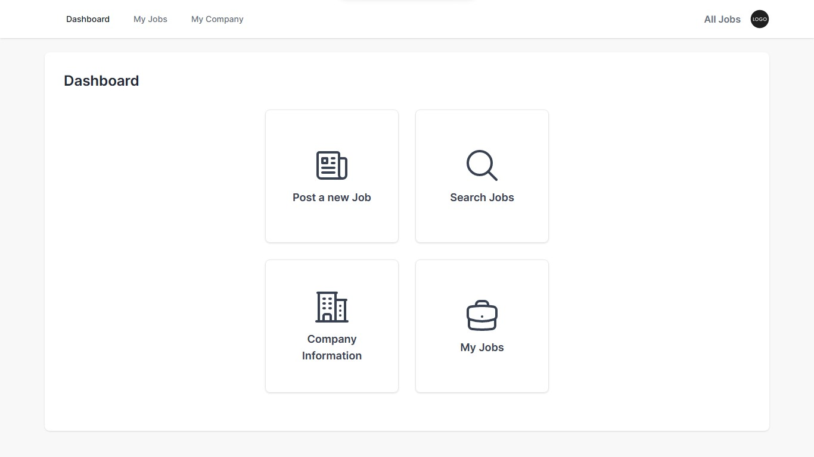
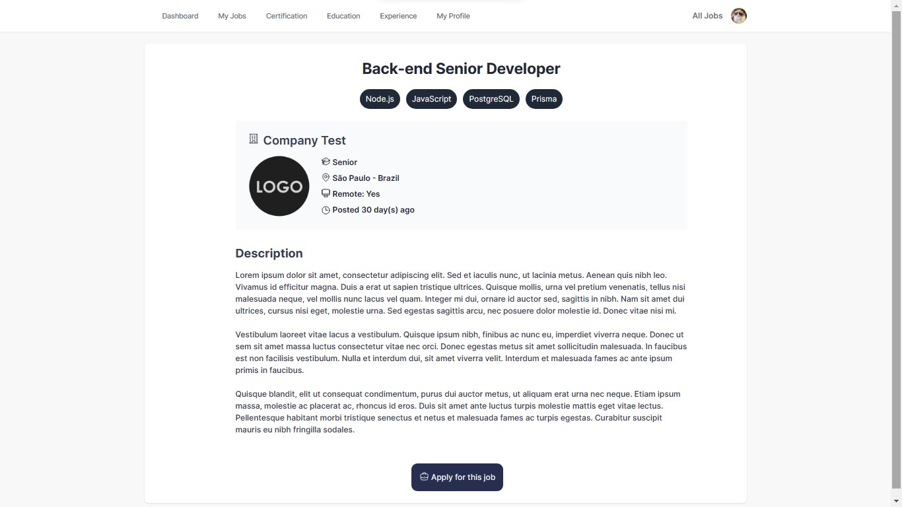

# DevUp

### Video demo: https://youtu.be/4CldSFFemZ0
***
## Description:

This is a web application where developers can find and apply for jobs, and companies can post job opportunities and look for candidates.

### Technologies
Back-end: Node.js, TypeScript, Express, Prisma.io, PostgreSQL.
Front-end: ReactJS, TypeScript, Tailwind, axios.

### [Back-end](#back-end-1)
- [Routing](#routing)
- [Middlewares](#middlewares)
- [Database](#database)
- [Modules](#modules)
- [Uploads](#uploads)

### [Front-end](#front-end-1)
- [Pages](#pages)
- [Components](#components)
- [Styles](#styles)
- [Services](#services)
- [Assets](#assets)
- [Utils](#utils)

# Back-end
## Routing

Inside the index file in the routes folder, you can see four routes: companies, users, authenticate, and jobs. 

- **/authenticate** - Route used for the authentication/login of users and companies

- **/companies** - Route used to manage a company account. 
  Use Cases: 
    - Create a company 
    - Upload logo 
    - Update the company information 
    - Get the company information.

- **/users** - Route used to manage the user account. 
  Use Cases: 
    - Create user 
    - Update the user information, get user information 
    - Upload avatar and resume
    - The ability to get, add and remove experiences, certifications, and education.

- **/jobs** - Route used to manage jobs by companies and users. Use Cases: 
    - Create a job 
    - Close or open a job, 
    - Delete a job 
    - Find all jobs, find a job by id, find jobs by company, find jobs by user 
    - Apply for a job, remove job application, check if the user is applied to a job, find the candidates for a job 

## Middlewares

Middlewares are functions that can access the HTTP request and can either terminate the request or forward it for further processing. This project has only one middleware, the `ensureAuthenticated` middleware. This middleware is used to ensure that a user is authenticated before proceeding to the request.

## Database

The database was created using `PostgreSQL` and `Prisma.io`. There are seven tables in the database, which are: 

- ### Companies

    | Column        | Type      |
    | :-------------| :-------- |
    | id            | `uuid`    | 
    | email         | `string`  |
    | password      | `string`  |
    | name          | `string`  |
    | description   | `string`  |
    | logo          | `string?` |
    | linkedin      | `string?` |
    | web_site      | `string?` |
    | employees_num | `number?` |
    | created_at    | `Date`    |

- ### User
    | Column            | Type       |
    | :---------------- | :--------- |
    | id                | `uuid`     | 
    | email             | `string`   |
    | password          | `string`   |
    | name              | `string`   |
    | birthday          | `string`   |
    | pic               | `string?`  |
    | about             | `string?`  |
    | salary_pretension | `number?`  |
    | github            | `string?`  |
    | linkedin          | `string?`  |
    | phone             | `number?`  |
    | headline          | `string?`  |
    | country           | `string?`  |
    | city              | `city?`    |
    | languages         | `string[]` |
    | level             | `string`   |
    | skills            | `string[]` |
    | resume            | `string?`  |
    | created_at        | `Date`     |    

- ### Jobs
    | Column       | Type       | 
    | :----------- | :--------- |
    | id           | `uuid`     |
    | company_id   | `string`   |
    | title        | `string`   |
    | description  | `string`   |
    | technologies | `string[]` |
    | level        | `string`   |
    | location     | `string?`  |
    | home_office  | `boolean`  |
    | open         | `boolean`  |
    | created_at   | `Date`     |

- ### UserExperiences
    | Column      | Type      | 
    | :---------- | :-------- |
    | id          | `uuid`    |
    | user_id     | `string`  |
    | title       | `string`  |
    | company     | `string`  |
    | location    | `string`  |
    | current     | `boolean` |
    | start_month | `number`  |
    | start_year  | `number`  |
    | end_month   | `number?` |
    | end_year    | `number?` |
    | created_at  | `Date`    |

- ### UserCertifications
    | Column       | Type      | 
    | :----------- | :-------- |
    | id           | `uuid`    |
    | user_id      | `string`  |
    | name         | `string`  |
    | organization | `string`  |
    | description  | `string?` |
    | issued_month | `number`  |
    | issued_year  | `number`  |
    | created_at   | `Date`    |

- ### UserEducation
    | Column      | Type      | 
    | :---------- | :-------- |
    | id          | `uuid`    |
    | user_id     | `string`  |
    | school      | `string`  |
    | degree      | `string`  |
    | field       | `string`  |
    | grade       | `string`  |
    | activities  | `string?` |
    | description | `string?` |
    | start_month | `number`  |
    | start_year  | `number`  |
    | end_month   | `number`  |
    | end_year    | `number`  |
    | created_at  | `Date`    |

- ### JobsOnUsers 
    | Column     | Type      | 
    | :--------- | :-------- |
    | id         | `uuid`    |
    | user_id    | `string`  |
    | jobs_id    | `string`  |
    | created_at | `Date`    |

The database schema can be found in the `schema.prisma` file, inside the **prisma** folder.

## Modules
There is one module for each main route (except for the *authenticate* route).

Each module has:

- **Repositories** - Repositories are the data layer in which you manage the database. Usually, CRUD operations are performed here.

- **Use Cases** - Handles all the business rules of a use case. 

A module can also have:

- **DTOs** - We can use DTOs to standardize the data of the API response structure. Telling what is going to be the format of an API call.

- **Mappers** - We can use mappers to transform the repository response if needed.

## Uploads

All the uploaded files are stored locally in the **uploads** folder.

# Front-end

## Pages

### Homepage

On the homepage, you can join as a company or developer, and you can log in to an existing account. 

### Sign up

Sign-up pages for developers and companies. 

| Dev sign up                                    | Company sign up                                       |
| :--------------------------------------------- | :---------------------------------------------------- |
|  |  |

### Log in

You can choose to log in as a company or developer. If you mark the 'Remember me' button your session will be saved for a few days.

### Dashboard

The dashboard has all the main functionalities. You can also log out by clicking on your picture inside the dashboard header. 

| Dev Dashboard                                       | Company Dashboard                                         |
| :-------------------------------------------------- | :-------------------------------------------------------- |
|  |  |

### Company jobs

On this page, you can see all your jobs, and the candidates for each job, open/close the job and delete a job.

### Dev Applied jobs

On this page, developers can see all the jobs they've applied for.

### Candidates

A company can see a list of candidates for a job and also check all of the candidate's information and contact.

| Candidates List                                   | Candidate Information                                       |
| :------------------------------------------------ | :---------------------------------------------------------- |
|  |  |

### Post a new job

On this page, a company can post a new job. You can add multiple technologies. The job location is optional.

### User Information

On these pages, you can edit your information, change your profile image, and upload a resume if you are a developer.

| Dev Information                                         | Company Information                                           |
| :------------------------------------------------------ | :------------------------------------------------------------ |
|  |  |

### Dev extra information

On these pages, the developer can add or remove experiences, certifications, and education.

| Experiences                                   | Education                                 | Certifications                                      |
| :-------------------------------------------- | :---------------------------------------- | :-------------------------------------------------- |
|  |  |  |
 
### Search jobs

On this page, you have an infinite scroll of all the jobs. You can search for a specific job, filter by job level, and choose to only show remote jobs.

### Job Information

This page contains all the job information. If you are a developer you can choose to apply or remove your application for the job.

## Components

Components are independent and reusable bits of code that return HTML. Can be used in other components and pages. 
  The components of this project are:

- **Avatar Profile**
- **Dashboard Header**
- **Form Inputs**
- **Index page header**
- **Job Information**
- **Job Search**
- **Loading**

## Styles

I decided to use TailwindCSS and TailwindUI for most of the project, so the main CSS file is App.css which is being used to add the tailwind directives and some extra styles.

## Services

The services folder contains the Axios configuration and can be used to make requests and fetch data from the database.

## Assets

The assets folder stores images and SVG images that are used in the interface.

## Utils
The utils folder contains some functions and objects that are used in many pages and components.

- **userNavigation / companyNavigation** - An array of objects, each object is a button for the dashboard header, containing the `name` of the button and the `href`.

- **getUpload** - A function that gets a file in the local folder where the uploads are stored. This function has two parameters: `filename`, and `folder`.

- **getDiffDate** - This function is responsible for getting the difference of days between the job posted date and the current date. If the difference is less than 1 then it will return "Posted today" or if the difference is more than 1 it will return "Posted (difference) days ago".